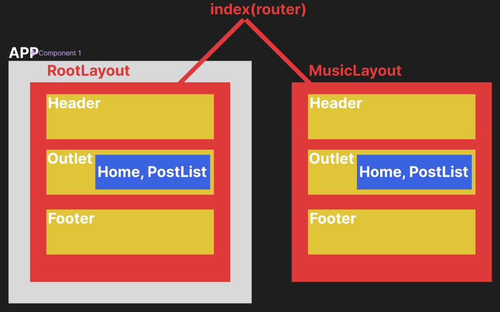

## <mark color="#fbc956">Route (라우트)</mark>

### 1. 라우팅 (Routing)

- 사용자가 웹 애플리케이션 내에서 다른 페이지로 이동할 수 있도록 경로를 지정하는 과정
- 웹 사이트나 애플리케이션이 여러 페이지로 구성될 때, 각 페이지 구분 및 페이지 간 전환 위해 라우팅 필요
- **라우팅의 필요성**
  1. **코드의 가독성 및 관리 용이성**
     - 각 페이지 별 코드를 독립적 구조로 관리 가능
  2. **페이지 구조화**
     - 라우팅을 통해 콘텐츠를 여러 페이지로 분리해 더 구조롸된 사용자 경험 제공
  3. **SPA의 장점을 유지하며 페이지 전환 효과**
     - SPA(Single Page Application)는 한 번 페이지 로드 후 페이지 전체를 새로고침할 필요 없어 빠르고 매끄러운 사용자 경험 제공
     - React Router는 SPA에서 각 페이지처럼 동작할 수 있게 해 기존의 여러 페이지에서 발생한 불필요한 새로고침없이 콘텐츠 전환 가능

### 2. 라우터 도입

> **파일 구조 (src 폴더 내)**
>
> - **pages**
>   - Home.jsx
>   - PostList.jsx
> - **components**
>   - Header.jsx
> - **router**
>   - index.jsx
> - App.jsx
> - RootLayout.jsx



1. `App` 에서 **`RouterProvider`** 통해 **하나의 페이지에서 상황에 따라 여러 Component** 보여줌

   ```jsx
   import React from "react";
   import { RouterProvider } from "react-router-dom";
   import router from "./router";

   export default function App() {
     return (
       <>
         {/* RouterProvider 통해 하나의 페이지에서 상황따라 보여줄 것 */}
         <RouterProvider router={router}></RouterProvider>
       </>
     );
   }
   ```

2. `index` 에서 **`createBrowserRouter`** 통해 URL 경로와 컴포넌트 매핑

   - `children` 을 통해 중첩된 라우트 지정 가능
   - **`path`**
     - **`index: tru**e` : 부모와 같은 path 갖게 됨
     - **`path: ""`** : 부모 라우트에 더해 추가적인 path 지정 가능

   ```jsx
   import { createBrowserRouter } from "react-router-dom";
   import Home from "../pages/Home";
   import PostList from "../pages/PostList";
   import RootLayout from "../RootLayout";

   {/* createBrowserRouter 통해 URL 경로와 컴포넌트 매핑 */}
   const router = createBrowserRouter([
     {
       path: "/",
       element: <RootLayout />,

       {/* children을 통해 중첩된 라우트 지정 가능 */}
       {/* RootLatout의 Outlet에 들어갈 children들 */}
       children: [
         {
   	      {/* 부모와 같은 path 가짐 */}
           index: true,
           element: <Home />,
         },
         {
   	      {/* 부모 라우트 + 자식 path : 추가적인 path 지정 가능 */}
           path: "/posts",
           element: <PostList />,
         },
       ],
     },
   ]);

   export default router;

   ```

3. `RootLayout` 라는 기존의 메인 페이지를 감싸는 컴포넌트 생성

   - **`Outlet`** : 부모 라우트가 자식 라우트를 렌더링할 위치 지정하는 컴포넌트

   ```jsx
   import React from "react";
   import { Outlet } from "react-router-dom";
   import Header from "./components/Header";

   export default function RootLayout() {
     return (
       <>
         {/* 내용이 고정된 Header component */}
         <Header></Header>
         {/* Outlet은 부모 라우트가 자식 라우트를 렌더링할 위치 지정하는 컴포넌트 */}
         {/* index.jsx에서 정의된 RootLayout의 children들이 Outlet에 들어감 */}
         <Outlet></Outlet>
         <footer>footer</footer>
       </>
     );
   }
   ```

4. `Header` 를 통해 Link를 담은 Header 생성

   ```jsx
   import React from "react";
   import { Link } from "react-router-dom";

   {
     /* Header component */
   }
   export default function Header() {
     return (
       <header>
         <ul>
           <li>
             <Link to="/">HOME으로</Link>
           </li>
           <li>
             <Link to="/posts">게시글로</Link>
           </li>
         </ul>
       </header>
     );
   }
   ```

5. `RootLayout` 의 `Outlet` 에 오는 `Home` 과 `PostList` 생성

   ```jsx
   {
     /* Outlet에 들어가는 Home component */
   }
   export default function Home() {
     return (
       <div>
         <div>Home</div>
       </div>
     );
   }
   ```

   ```jsx
   import React from "react";

   {
     /* Outlet에 들어가는 PostList component */
   }
   export default function PostList() {
     const posts = [
       {
         id: 1,
         title: "첫 번째 프로젝트",
         content:
           "첫 프로젝트에서 간단한 Todo 앱을 만들었습니다. UI 구성과 상태 관리의 중요성을 배웠습니다.",
       },
       {
         id: 2,
         title: "리액트와 함께한 성장",
         content:
           "리액트로 컴포넌트 기반 개발을 익히고, 재사용성을 높이는 방법을 이해하게 되었습니다.",
       },
       {
         id: 3,
         title: "팀 프로젝트 경험",
         content:
           "팀원들과 협업하여 일정 관리 앱을 개발했습니다. Git을 활용한 버전 관리와 코드 리뷰의 중요성을 체감했습니다.",
       },
     ];

     const postsList = posts.map((post) => {
       const { id, title, content } = post;

       return (
         <li key={id}>
           <h3>{title}</h3>
           <p>{content}</p>
         </li>
       );
     });

     return (
       <>
         <ul>{postsList}</ul>
       </>
     );
   }
   ```

### 3. 개별 페이지

- PostDetail은 개별 페이지를 가짐 → pages 폴더 내부에 작성

> **파일 구조 (src 폴더 내)**
>
> - **pages**
>   - Home.jsx
>   - PostList.jsx
>   - **PostDetail.jsx**
> - **components**
>   - Header.jsx
> - **router**
>   - index.jsx
> - App.jsx
> - RootLayout.jsx

1. `index` 에서 **`<PostDetail />` 의 경로 지정**

   - `PostDetail` 의 URL은 `posts/{postId}` → `postId`는 게시글에 따라 변화
     = **동적 라우팅, `/posts/:{변수명}` 으로 사용**

   ```jsx
   import { createBrowserRouter } from "react-router-dom";
   import Home from "../pages/Home";
   import PostList from "../pages/PostList";
   import RootLayout from "../RootLayout";
   import PostDetail from "../pages/PostDetail";

   const router = createBrowserRouter([
     {
       path: "/",
       element: <RootLayout />,
       children: [
         {
           index: true,
           element: <Home />,
         },
         {
           path: "/posts",
           element: <PostList />,
         },
         {
   	      {/* 동적 라우팅, 게시글 마다 변하는 postId는 앞에 콜론(:)을 붙임 */}
           path: "/posts/:postId",
           element: <PostDetail />,
         },
       ],
     },
   ]);

   export default router;
   ```

2. `PostList` 에서 `PostDetail` 로 **이동할 수 있는 `Link` 생성**

   - **Link 이용한 이동**
     - **`to`** : 경로 지정
       - 백틱을 이용해 각 `post`의 `id` 전달
     - **`state`** : 지정한 경로로 전달해줄 데이터 (`PostList.jsx` → `PostDetail.jsx`)
       - post는 객체 이므로 중괄호로 한번 더 감싸 전달

   ```jsx
   import React from "react";
   import { Link } from "react-router-dom";

   export default function PostList() {
     const posts = [
       {
         id: 1,
         title: "첫 번째 프로젝트",
         content:
           "첫 프로젝트에서 간단한 Todo 앱을 만들었습니다. UI 구성과 상태 관리의 중요성을 배웠습니다.",
       },
       {
         id: 2,
         title: "리액트와 함께한 성장",
         content:
           "리액트로 컴포넌트 기반 개발을 익히고, 재사용성을 높이는 방법을 이해하게 되었습니다.",
       },
       {
         id: 3,
         title: "팀 프로젝트 경험",
         content:
           "팀원들과 협업하여 일정 관리 앱을 개발했습니다. Git을 활용한 버전 관리와 코드 리뷰의 중요성을 체감했습니다.",
       },
     ];

     return (
       <>
         <h3>Posts</h3>
         <ul>
           {posts.map((post) => {
             const { id, title, content } = post;

             return (
               // 1. JSX 내부에서 사용하기 좋음
               <li key={id}>
                 <Link to={`/posts/${id}`} state={{ post }}>
                   <h3>{title}</h3>
                 </Link>
               </li>
             );
           })}
         </ul>
       </>
     );
   }
   ```

   - **`useNavigate` 를 활용한 프로그래밍 방식을 이용한 이동**
     - 태그에 이벤트 핸들러 내부 `navigate({ URL })` 작성해 이동 지정

   ```jsx
   import React from "react";
   import { Link, useNavigate } from "react-router-dom";

   export default function PostList() {
     const navigate = useNavigate();

     const posts = [
       {
         id: 1,
         title: "첫 번째 프로젝트",
         content:
           "첫 프로젝트에서 간단한 Todo 앱을 만들었습니다. UI 구성과 상태 관리의 중요성을 배웠습니다.",
       },
       {
         id: 2,
         title: "리액트와 함께한 성장",
         content:
           "리액트로 컴포넌트 기반 개발을 익히고, 재사용성을 높이는 방법을 이해하게 되었습니다.",
       },
       {
         id: 3,
         title: "팀 프로젝트 경험",
         content:
           "팀원들과 협업하여 일정 관리 앱을 개발했습니다. Git을 활용한 버전 관리와 코드 리뷰의 중요성을 체감했습니다.",
       },
     ];

     return (
       <>
         <h3>Posts</h3>
         <ul>
           {posts.map((post) => {
             const { id, title, content } = post;

             return (
               <li key={id}>
                 {/* 2. JavaScript에서 이동 지정할때 */}
                 <h3
                   onClick={() => {
                     navigate(`/posts/${id}`);
                   }}
                 >
                   {title}
                 </h3>
               </li>
             );
           })}
         </ul>
       </>
     );
   }
   ```

3. `PostDetail` 에서 받은 post 활용
   - `useParams` 통해 `PostDetail` 에서 해당 path parameter에 접근 가능
   - `useLocation` 통해 `PostList` 에서 전달받은 post 활용

```jsx
import React from "react";
import { useLocation, useParams } from "react-router-dom";

export default function PostDetail() {
  {
    /* index.jsx에서 path로 지정한 postId를 넘겨받음 */
  }
  const { postId } = useParams();

  {
    /* PostList에서 넘겨받은 state의 post 활용 가능 */
  }
  const location = useLocation();
  const { post } = location.state;
  const { title, content } = post;

  return (
    <div>
      <h3>{title}</h3>
      <p>{content}</p>
      <p>{postId}번째 게시글</p>
    </div>
  );
}
```

> **location에서 확인 가능 정보**
>
> - state
> - pathname : 현재 경로
> - search : 쿼리 파라미터
> - hash : (#) 해시
>
> → 쿼리 파라미터는 `useSearchParams` 통해 확인 가능

### 3. 에러 페이지

- 에러 발생했을 경우 직접 컴포넌트 만들어 사용자에게 보여줄 수 있음
- pages 폴더 내 NotFound 파일 생성

> **파일 구조 (src 폴더 내)**
>
> - **pages**
>   - Home.jsx
>   - PostList.jsx
>   - PostDetail.jsx
>   - **NotFound.jsx**
> - **components**
>   - Header.jsx
> - **router**
>   - index.jsx
> - App.jsx
> - RootLayout.jsx

1. `index` 에 `errorElement` 로 NotFound 컴포넌트 지정

   ```jsx
   import { createBrowserRouter } from "react-router-dom";
   import Home from "../pages/Home";
   import PostList from "../pages/PostList";
   import RootLayout from "../RootLayout";
   import PostDetail from "../pages/PostDetail";
   import NotFound from "../pages/NotFound";

   const router = createBrowserRouter([
     {
       path: "/",
       element: <RootLayout />,
       errorElement: <NotFound />,
       children: [
         {
           index: true,
           element: <Home />,
         },
         {
           path: "/posts",
           element: <PostList />,
         },
         {
           path: "/posts/:postId",
           element: <PostDetail />,
         },
       ],
     },
   ]);

   export default router;
   ```

   ```jsx
   import React from "react";

   export default function NotFound() {
     return <div>NotFound</div>;
   }
   ```
