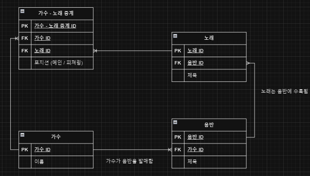
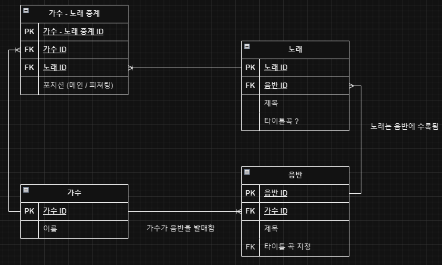
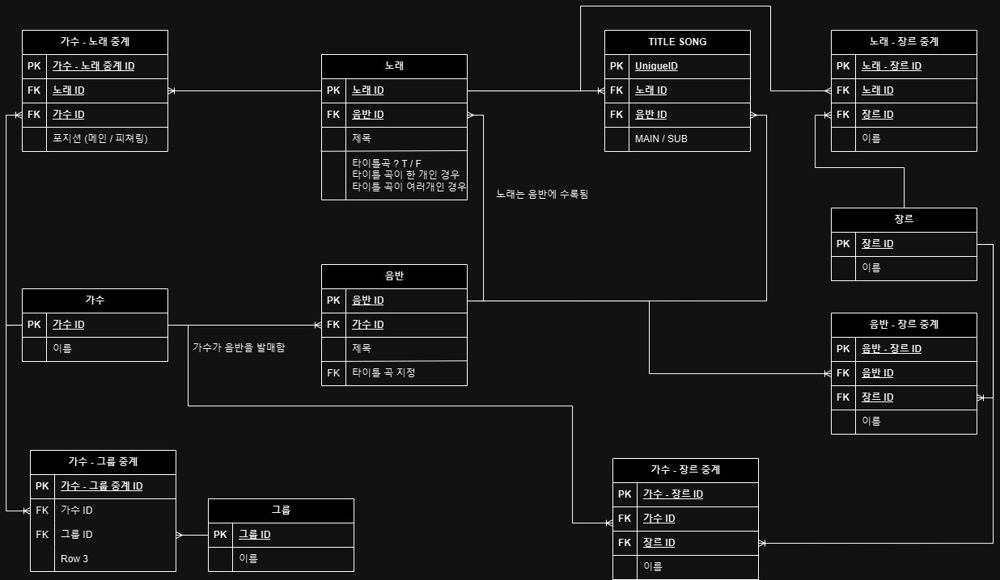
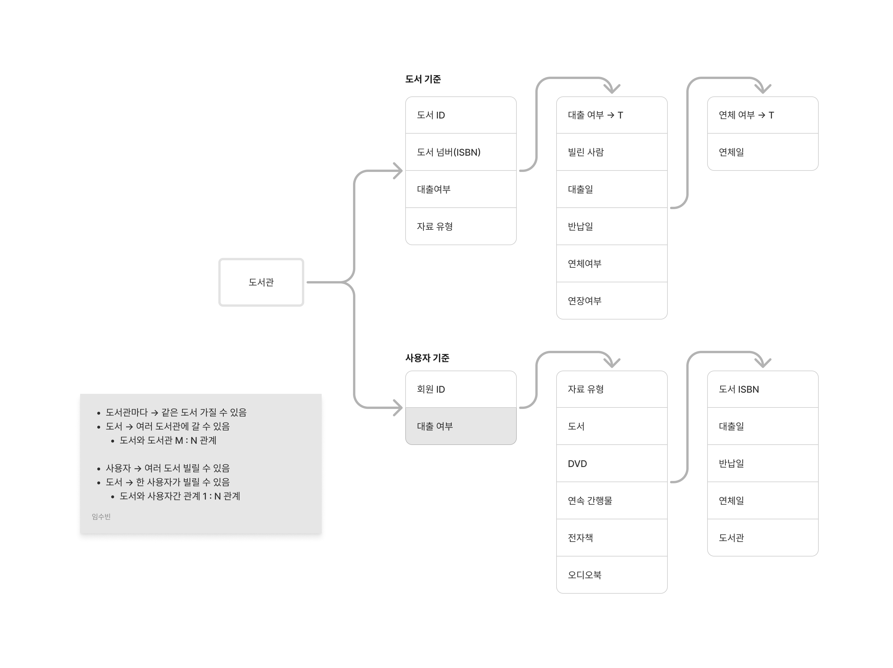
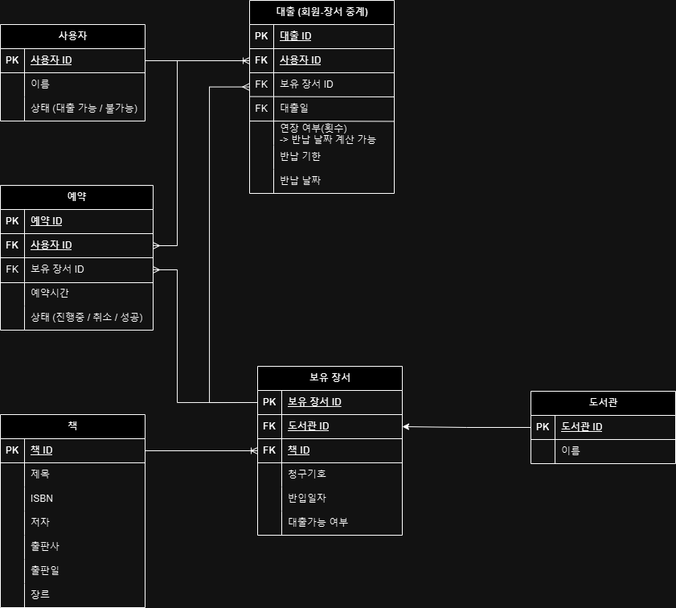

1. 기획
2. 화면 그리기
   - 백엔드
     - ERD → API
   - 프론트엔드
     - 컴포넌트 → API로 적용

- **가수와 노래 M : N**
  - 가수와 중계테이블 1 : N
  - 노래와 중계테이블 1 : N
    
- **1 : N 관계**
  - N에서 FK 가져야함
  - 표현 방법이 하나뿐
- **1 : 1 관계 (노래와 음반의 타이틀)**
  - 어디서든 값을 표현할 수 있음 → 이는 상황에 따라 결정
  - 노래에서 타이틀 곡이니? 물을 수 있음
  - 음반에서 타이틀 곡 지정해줄 수 있음
    
  - 타이틀 곡이 여러개인 경우 테이블 따로 분리
    - 데이터의 정합성 생각해보기
      - 서로 같은 정보들이 연결 연결되어 있음
        
        
- 도서관 플랫폼
  
  
