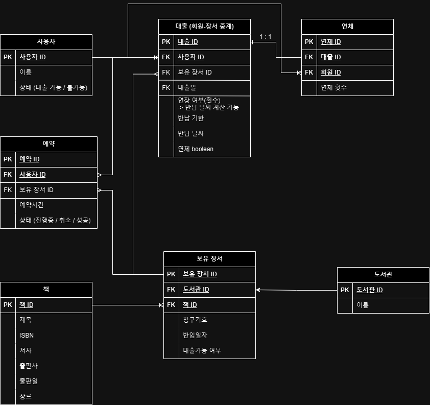
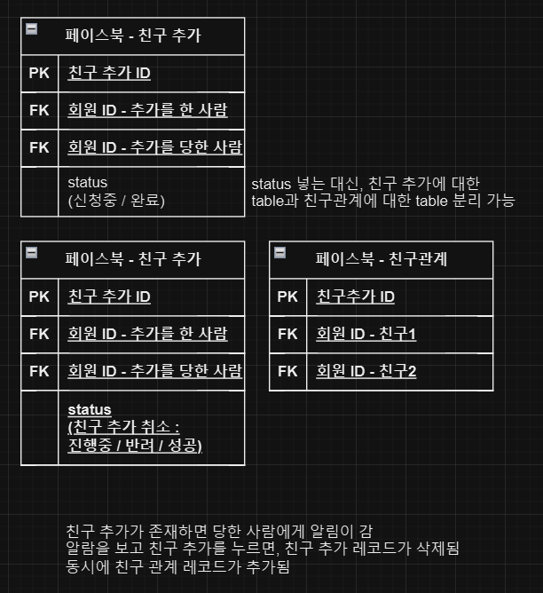
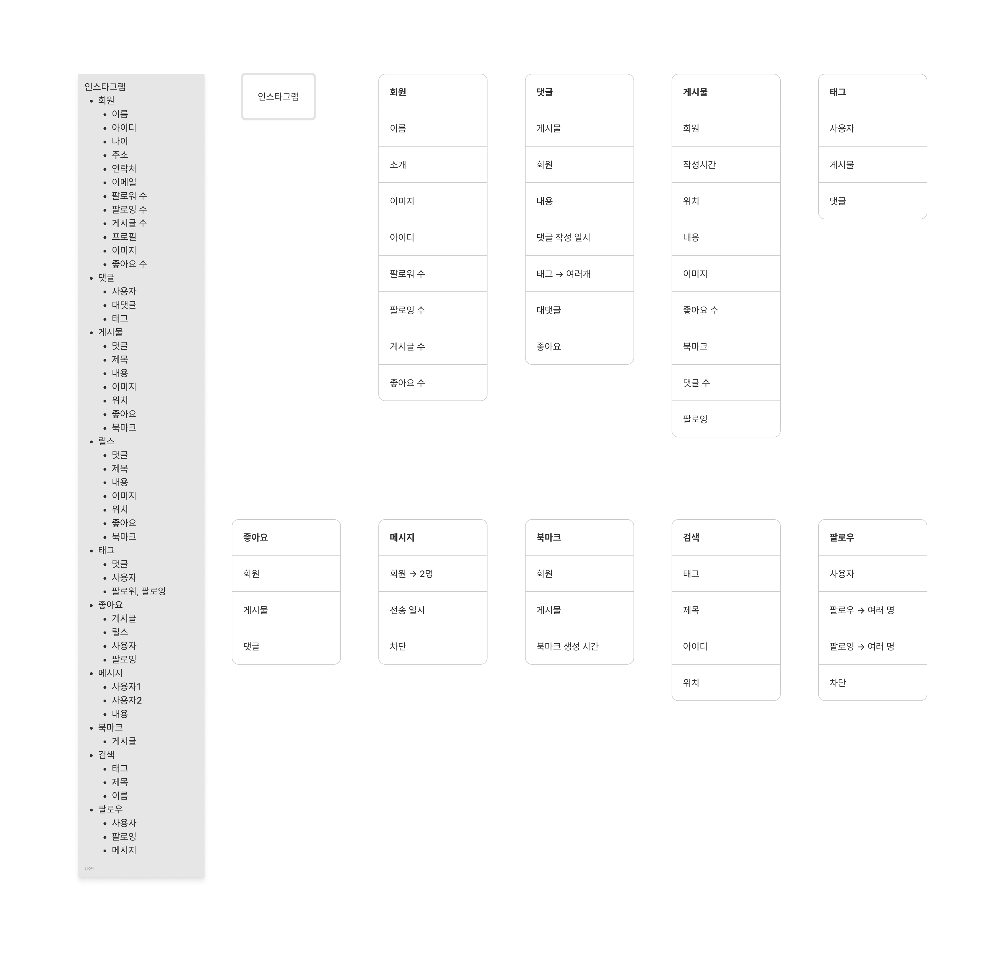
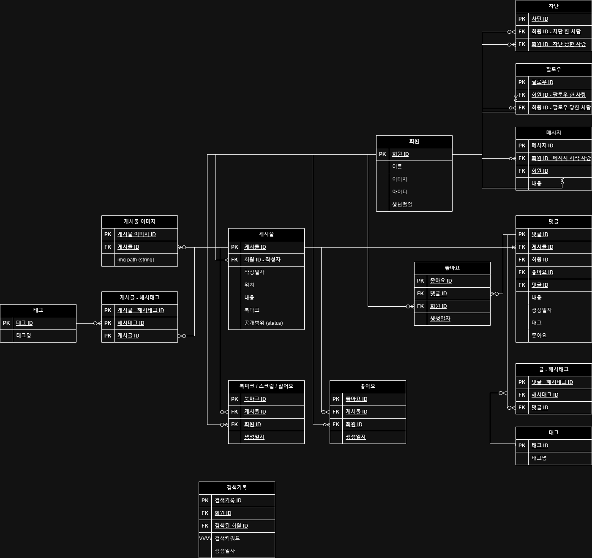

- **도서관 플랫폼**
  - 연체 → 대출과 관련 (1 : 1 관계)
    - 여러 대출에서 연체가 일어날 수 있지만 연체를 추가하지 않고 수정한다는 가정으로 1 : 1 관계
    - 잘 사용하지 않는 1 : 1의 경우 분리하는 것이 좋음
    - 회원과 연체는 1 : N 관계
  
- **SNS**
  - 유저간 관계
    - 인스타그램 → 팔로 / 팔로잉 (일방)
    - 페이스북 → 친구 추가 (승낙 후 쌍방향)
      - 친구 관계의 두 가지 경우
        1. 1 → 2 and 2 → 1 같이 저장

           (진행중 → 2 친구 추가 승낙 → 완료)

        2. 1 → 2 통해 승낙 불러옴
      - 친구 추가 / 친구 관계의 테이블
      
    - 싸이월드 → 일촌 추가 (승낙 후 쌍방향)
  - 게시물 이미지
    - 이미지의 경로 저장
  - 생성 일자, 수정 일자, 삭제 일자 → 많이 사용
  - 북마크, 좋아요, 스크립, 싫어요
    - 반복적 → 엔티티의 형식을 재사용 가능
  - SNS 데이터 적어보기
    
  - 데이터 기준으로 ERD 작성
    
