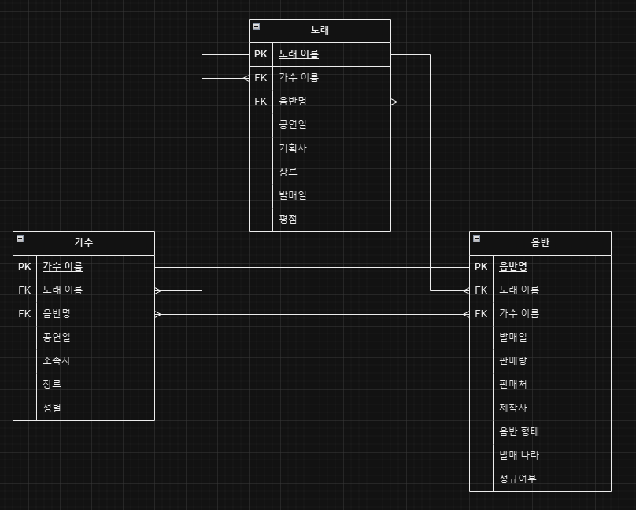
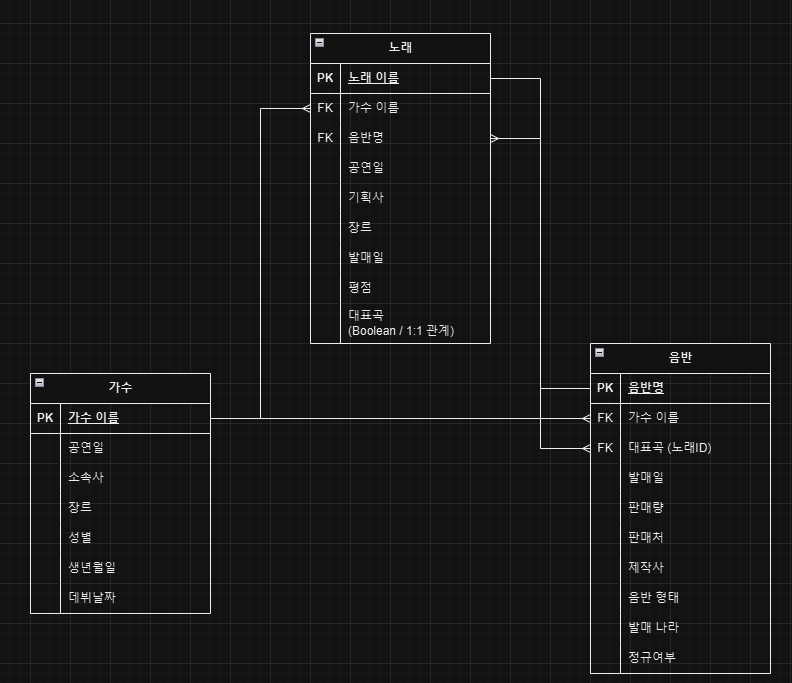
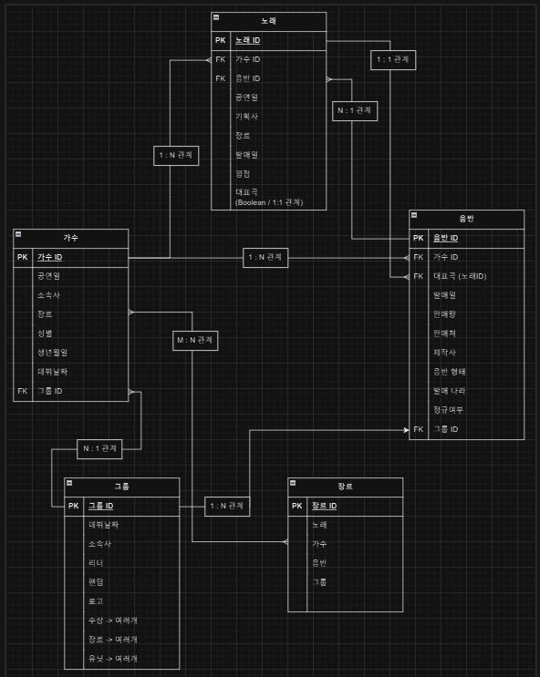

## 데이터베이스 설계

---

### 1. Key

- 데이터베이스에서 데이터를 식별하고 구분하는데 사용되는 특별한 필드나 필드들의 집합

1. **기본키 (Primary Key)**
   - 테이블의 각 레코드를 고유하게 식별하는 필수적인 키
   - NULL 값을 가질 수 없고, 중복될 수 없음
2. **외래키 (Foreign Key)**
   - 다른 테이블의 기본키를 참조하는 키
   - 테이블 간의 관계를 정의하는데 사용
3. **후보키 (Candidate Key)**
   - 기본키가 될 수 있는 자격이 있는 키
   - 유일성과 최소성을 만족
4. **자연키 (Natural Key)**
   - 실제 업무에서 사용되는 의미 있는 데이터를 키로 사용
5. **대리키 / 인조키 (Surrogate Key / Artificial Key)**
   - 인위적으로 생성한 식별자
   - 보통 일련번호 형태로 자동 생성됨

### 2. 데이터 무결성 (Data Integrity)

- 데이터의 정확성과 일관성을 유지하고 보증하는 것

1. **개체 무결성 (Entity Integrity)**
   - 테이블의 각 행이 유일하게 식별될 수 있도록 보장하는 것
   - 주로 기본키(PK) 제약 조건을 통해 이루어짐
2. **참조 무결성 (Referential Integrity)**
   - 외래키(FK)를 통한 테이블 간의 관계에서 유지되어야 하는 데이터의 일관성
   - 외래키는 다른 테이블의 기본키를 참조해 테이블 간의 관계를 맺음
     - 참조 무결성은 이 참조 관계가 유효한 데이터를 가리키도록 보장
     - 외래키 값은 NULL이거나 참조하는 테이블의 기본키 값 중 하나와 일치
3. **도메인 무결성 (Domain Integrity)**
   - 테이블의 필드가 정의된 도메인(유효한 값의 집합)에 속한 값만을 가져야 함
   - 이는 데이터 타입, 데이터 형식, 범위 제한, 기본값 설정 등을 통해 구현

### 3. 정규화 (Normalization)

- 데이터를 구조화해 중복 최소화, 데이터 무결성을 유지하기 위한 과정
- 목적
  - 데이터 중복 최소화
  - 데이터 무결성 유지
  - 이상현상(Anomaly) 방지
  - 데이터의 일관성과 정확성 보장
  - 효율적인 데이터 구조 설계

1. **제 1정규형 (1NF, First Normal Form)**
   - 각 컬럼의 값이 원자값(분할 불가능한 값)을 가져야 함
2. **제 2정규형 (2NF)**
   - 1NF를 만족하고, 모든 비주요 속성이 후보키 전체에 완전히 함수적으로 의존
   - 어떤 column이 row를 구분할 수 있는 column들과 관계 없을 경우 다른 테이블로 분리
3. **제 3정규형 (3NF)**
   - 2NF를 만족하고, 기본키가 아닌 모든 컬럼이 테이블의 기본키에 이행적 종속이 되지 않음
   - A → B 이고, B → C 일 때, A → C 가 성립할 경우 다른 테이블로 분리
4. **BCNF (Boyce-Codd Normal Form)**
5. **제 4정규형 (4NF)**
6. **제 5정규형 (5NF)**

### 4. 반정규화 (Denormalization)

- 성능 향상을 위해 의도적으로 정규화를 위배하는 것
- 데이터의 중복 허용, 조회 성능이 중요한 경우 도입
- 데이터 무결성과 성능 사이의 트레이드 오프 고려

### 5. 데이터베이스 스키마(Database Schena)

- 데이터베이스에서 자료의 구조, 자료의 표현 방법, 자료 간의 관계를 정의한 것
- 스키마
  - 데이터베이스 설계의 청사진 역할
  - 데이터베이스 시스템에서 데이터를 어떻게 저장하고 접근할지에 대한 정보 제공

### 6. ERD (Entity-Relationship Diagram)

- 데이터베이스의 구조를 시각적으로 표현하는 도구
- 스키마를 시각화한 것
- **구성 요소**
  1. **Entity (엔티티)**
     - 데이터베이스에 저장되는 주체
  2. **Attribute (속성)**
     - 엔티티를 구성하는 세부 항목
     - 엔티티의 특성을 나타냄
  3. **Relationship (관계)**
     - 두 엔티티 사이의 연관성 (일대일, 일대다, 다대다 등)
     - 선으로 표현 → 연결된 엔티티 사이 나타냄
  4. **Primary Key (기본키)**
     - 각 엔티티 내에서 각 인스턴스(또는 행)을 고유하게 식별하는 속성
  5. **Foreign Key (외래키)**
     - 다른 엔티티의 기본키를 참조해 두 엔티티 사이의 관계를 설정하는 속성

### 7. 도메인 (Domain)

- 각 필드에 들어갈 수 있는 값의 유형과 범위 정의한 것
- 하나의 속성이 취할 수 있는 값들의 집합

1. **문자열 타입**
   - CHAR : 고정 길이 문자열
     - 지정된 길이만큼 공간 차지
   - VARCHAR : 가변 길이 문자열
     - 실제 데이터 길이만큼만 공간 차지
   - TEXT : 긴 문자열
     - 대용량 텍스트 지정 가능
2. **숫자 타입**
   - INTEGER : 정수
     - 소수점 없는 숫자
   - DECIMAL : 정확한 소수점 계산이 필요한 숫자
     - 정확한 소수점 계산 가능
3. **날짜/시간 타입**
   - DATE : 날짜
   - TIMESTAMP : 날짜와 시간
     - 시/분/초까지 기록
4. **기타**
   - BOOLEAN : 논리 - 참/거짓
     - TRUE / FALSE
   - ENUM : 열거형 - 미리 정의된 값만 허용
     - 제한된 값들 중에서만 선택 가능

### 8. ERD 그려보기

- ERD - 가수, 노래, 음반 간의 관계
  
  - 가수
    - 소속사 → 따로 빼는 것이 좋음
    - 나이 → 매년 업데이트 해줘야 함 → 생년월일로 변경
    - 음반 → 여러개임 FK로 불가
  - 음반
    - 가수 → 한 명으로 FK 할 수 있음
    - 장르 → 다른 테이블로 사용해 가수와 연관시켜 사용 가
  - 삼각형으로 좋은 형태가 아님
    - 가수와 노래를 끊자 ! → 하지만 굳이 노래를 음반을 거쳐서 가야하나? 그러면 이어주자
      → 반정규화 (만들려는 프로덕트에 따라 다)
  
- 그룹과 장르 추가
  
