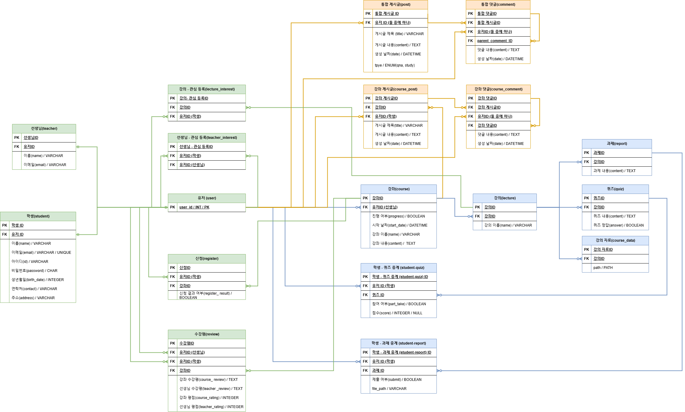
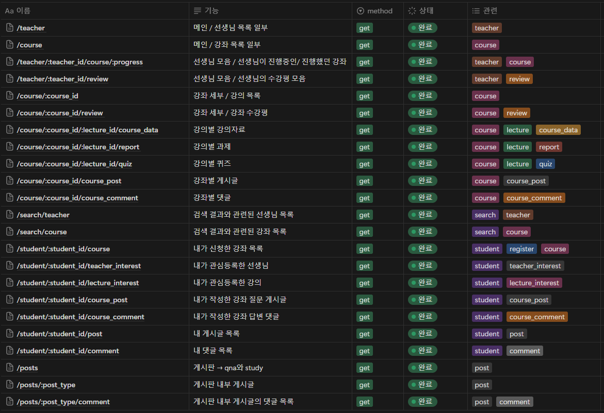

## <mark color="#fbc956">인터넷 강의 사이트에 필요한 데이터 조회</mark>

### 1. ERD 설계

- ERD 이미지
  

- 더미 데이터

  ```jsx
  -- 유저 테이블
  CREATE TABLE User (
      userID INT PRIMARY KEY AUTO_INCREMENT,
      name VARCHAR(100) NOT NULL,
      email VARCHAR(100) NOT NULL UNIQUE,
      password CHAR(60) NOT NULL,
      age INT,
      address VARCHAR(255)
  );

  -- 학생 테이블
  CREATE TABLE Student (
      studentID INT PRIMARY KEY AUTO_INCREMENT,
      userID INT NOT NULL,
      FOREIGN KEY (userID) REFERENCES User(userID)
  );

  -- 선생 테이블
  CREATE TABLE Teacher (
      teacherID INT PRIMARY KEY AUTO_INCREMENT,
      userID INT NOT NULL,
      FOREIGN KEY (userID) REFERENCES User(userID)
  );

  -- 강의 테이블
  CREATE TABLE Course (
      courseID INT PRIMARY KEY AUTO_INCREMENT,
      courseName VARCHAR(200) NOT NULL,
      startDate DATE,
      endDate DATE,
      description TEXT
  );

  -- 강의자료 테이블
  CREATE TABLE Course_Data (
      dataID INT PRIMARY KEY AUTO_INCREMENT,
      courseID INT NOT NULL,
      path VARCHAR(255) NOT NULL,
      FOREIGN KEY (courseID) REFERENCES Course(courseID)
  );

  -- 퀴즈 테이블
  CREATE TABLE Quiz (
      quizID INT PRIMARY KEY AUTO_INCREMENT,
      courseID INT NOT NULL,
      score INT,
      content TEXT,
      FOREIGN KEY (courseID) REFERENCES Course(courseID)
  );

  -- 리포트 테이블
  CREATE TABLE Report (
      reportID INT PRIMARY KEY AUTO_INCREMENT,
      courseID INT NOT NULL,
      path VARCHAR(255) NOT NULL,
      FOREIGN KEY (courseID) REFERENCES Course(courseID)
  );

  -- 수강등록 테이블
  CREATE TABLE Register (
      registerID INT PRIMARY KEY AUTO_INCREMENT,
      studentID INT NOT NULL,
      courseID INT NOT NULL,
      registrationDate DATE NOT NULL,
      isCompleted BOOLEAN DEFAULT FALSE,
      FOREIGN KEY (studentID) REFERENCES Student(studentID),
      FOREIGN KEY (courseID) REFERENCES Course(courseID)
  );

  -- 수강평 테이블
  CREATE TABLE View (
      viewID INT PRIMARY KEY AUTO_INCREMENT,
      courseID INT NOT NULL,
      studentID INT NOT NULL,
      review TEXT,
      rating INT,
      FOREIGN KEY (courseID) REFERENCES Course(courseID),
      FOREIGN KEY (studentID) REFERENCES Student(studentID)
  );

  -- 활동게시글 테이블
  CREATE TABLE Post (
      postID INT PRIMARY KEY AUTO_INCREMENT,
      userID INT NOT NULL,
      title VARCHAR(200) NOT NULL,
      content TEXT,
      postDate DATETIME DEFAULT CURRENT_TIMESTAMP,
      FOREIGN KEY (userID) REFERENCES User(userID)
  );

  -- 활동댓글 테이블
  CREATE TABLE Comment (
      commentID INT PRIMARY KEY AUTO_INCREMENT,
      postID INT NOT NULL,
      userID INT NOT NULL,
      content TEXT,
      commentDate DATETIME DEFAULT CURRENT_TIMESTAMP,
      FOREIGN KEY (postID) REFERENCES Post(postID),
      FOREIGN KEY (userID) REFERENCES User(userID)
  );

  -- 강의게시글 테이블
  CREATE TABLE Course_Post (
      postID INT PRIMARY KEY AUTO_INCREMENT,
      courseID INT NOT NULL,
      title VARCHAR(200) NOT NULL,
      content TEXT,
      postDate DATETIME DEFAULT CURRENT_TIMESTAMP,
      FOREIGN KEY (courseID) REFERENCES Course(courseID)
  );

  -- 강의댓글 테이블
  CREATE TABLE Course_Comment (
      commentID INT PRIMARY KEY AUTO_INCREMENT,
      postID INT NOT NULL,
      userID INT NOT NULL,
      content TEXT,
      commentDate DATETIME DEFAULT CURRENT_TIMESTAMP,
      FOREIGN KEY (postID) REFERENCES Course_Post(postID),
      FOREIGN KEY (userID) REFERENCES User(userID)
  );

  -- 강의 관심 테이블 (Teacher Interest)
  CREATE TABLE Teacher_Interest (
      interestID INT PRIMARY KEY AUTO_INCREMENT,
      teacherID INT NOT NULL,
      topic VARCHAR(200),
      FOREIGN KEY (teacherID) REFERENCES Teacher(teacherID)
  );

  -- 학생 관심 테이블 (Lecture Interest)
  CREATE TABLE Lecture_Interest (
      interestID INT PRIMARY KEY AUTO_INCREMENT,
      studentID INT NOT NULL,
      topic VARCHAR(200),
      FOREIGN KEY (studentID) REFERENCES Student(studentID)
  );

  -- 강의(Lecture) 테이블
  CREATE TABLE Lecture (
      lectureID INT PRIMARY KEY AUTO_INCREMENT,
      courseID INT NOT NULL,
      lectureName VARCHAR(200) NOT NULL,
      FOREIGN KEY (courseID) REFERENCES Course(courseID)
  );
  ```

  ```jsx
  -- 1. 유저 데이터 삽입
  INSERT INTO User (name, email, password, age, address) VALUES
  ('김철수', 'chulsoo@example.com', 'password123', 25, '서울시 강남구'),
  ('이영희', 'younghee@example.com', 'password456', 28, '부산시 해운대구'),
  ('박선생', 'teacher@example.com', 'password789', 35, '서울시 종로구');

  -- 2. 학생 데이터 삽입
  INSERT INTO Student (userID) VALUES
  (1), -- 김철수
  (2); -- 이영희

  -- 3. 선생 데이터 삽입
  INSERT INTO Teacher (userID) VALUES
  (3); -- 박선생

  -- 4. 강의 데이터 삽입
  INSERT INTO Course (courseName, startDate, endDate, description) VALUES
  ('프로그래밍 입문', '2024-01-01', '2024-03-01', '프로그래밍 기초 강의'),
  ('데이터베이스 기본', '2024-02-01', '2024-04-01', 'DB 개념 및 SQL 실습');

  -- 5. 강의(Lecture) 데이터 삽입
  INSERT INTO Lecture (courseID, lectureName) VALUES
  (1, '파이썬 기초'),
  (1, '파이썬 실습'),
  (2, 'SQL 기초'),
  (2, 'ERD 설계');

  -- 6. 강의자료(Course_Data) 데이터 삽입
  INSERT INTO Course_Data (courseID, path) VALUES
  (1, '/data/python_intro.pdf'),
  (2, '/data/sql_basics.pdf');

  -- 7. 퀴즈(Quiz) 데이터 삽입
  INSERT INTO Quiz (courseID, score, content) VALUES
  (1, 100, '파이썬 기초 퀴즈'),
  (2, 80, 'SQL 기본 퀴즈');

  -- 8. 리포트(Report) 데이터 삽입
  INSERT INTO Report (courseID, path) VALUES
  (1, '/reports/python_report.docx'),
  (2, '/reports/sql_report.docx');

  -- 9. 수강등록(Register) 데이터 삽입
  INSERT INTO Register (studentID, courseID, registrationDate, isCompleted) VALUES
  (1, 1, '2024-01-01', TRUE), -- 김철수, 프로그래밍 입문
  (2, 2, '2024-02-01', FALSE); -- 이영희, 데이터베이스 기본

  -- 10. 수강평(View) 데이터 삽입
  INSERT INTO View (courseID, studentID, review, rating) VALUES
  (1, 1, '매우 유익한 강의였습니다.', 5),
  (2, 2, '내용이 다소 어렵지만 흥미로웠습니다.', 4);

  -- 11. 활동게시글(Post) 데이터 삽입
  INSERT INTO Post (userID, title, content) VALUES
  (1, '프로그래밍 공부 방법', '파이썬 공부가 정말 재밌습니다!'),
  (2, 'SQL 실습 후기', '조금 어렵지만 유용합니다.');

  -- 12. 활동댓글(Comment) 데이터 삽입
  INSERT INTO Comment (postID, userID, content) VALUES
  (1, 2, '공감합니다!'),
  (2, 1, '응원합니다.');

  -- 13. 강의게시글(Course_Post) 데이터 삽입
  INSERT INTO Course_Post (courseID, title, content) VALUES
  (1, '파이썬 강의 질문', '파이썬 리스트 활용 방법을 알고 싶습니다.');

  -- 14. 강의댓글(Course_Comment) 데이터 삽입
  INSERT INTO Course_Comment (postID, userID, content) VALUES
  (1, 3, '리스트 관련 자료를 참고하세요.');

  -- 15. 강의 관심(Teacher_Interest) 데이터 삽입
  INSERT INTO Teacher_Interest (teacherID, topic) VALUES
  (1, '프로그래밍');

  -- 16. 학생 관심(Lecture_Interest) 데이터 삽입
  INSERT INTO Lecture_Interest (studentID, topic) VALUES
  (1, '파이썬'),
  (2, 'SQL');
  ```

- 더미데이터 변경본 + sql 파일

  ```sql
  -- 유저 테이블
  CREATE TABLE user (
    user_id INT NOT NULL AUTO_INCREMENT,
    PRIMARY KEY (user_id)
  );

  -- 학생 테이블
  CREATE TABLE student (
    student_id INT PRIMARY KEY AUTO_INCREMENT,
    user_id INT NOT NULL,
    name VARCHAR(100) NOT NULL,
    email VARCHAR(100) NOT NULL NULL,
    id CHAR(60) NOT NULL,
    password CHAR(60) NOT NULL,
    bitrh_date INT NOT NULL,
    contact VARCHAR(20) NOT NULL,
    address VARCHAR(255),
    FOREIGN KEY (user_id) REFERENCES user(user_id)
  );

  -- 선생님 테이블
  CREATE TABLE teacher (
    teacher_id INT PRIMARY KEY AUTO_INCREMENT,
    user_id INT NOT NULL,
    name VARCHAR(100) NOT NULL,
    email VARCHAR(100) NOT NULL,
    FOREIGN KEY (user_id) REFERENCES user(user_id)
  );

  -- 강좌 테이블
  CREATE TABLE course (
    course_id INT PRIMARY KEY AUTO_INCREMENT,
    course_name VARCHAR(20) NOT NULL,
    start_date DATETIME NOT NULL,
    progress BOOLEAN DEFAULT FALSE,
    content TEXT
  );

  -- 강의 테이블
  CREATE TABLE lecture (
    lecture_id INT PRIMARY KEY AUTO_INCREMENT,
    course_id INT NOT NULL,
    lecture_name VARCHAR(200) NOT NULL,
    FOREIGN KEY (course_id) REFERENCES course(course_id)
  );

  -- 강의자료 테이블
  CREATE TABLE course_data (
    data_id INT PRIMARY KEY AUTO_INCREMENT,
    lecture_id INT NOT NULL,
    path VARCHAR(255) NOT NULL,
    FOREIGN KEY (lecture_id) REFERENCES lecture(lecture_id)
  );

  -- 퀴즈 테이블
  CREATE TABLE quiz (
    quiz_id INT PRIMARY KEY AUTO_INCREMENT,
    lecture_id INT NOT NULL,
    content VARCHAR(200) NOT NULL,
    answer BOOLEAN DEFAULT FALSE,
    FOREIGN KEY (lecture_id) REFERENCES lecture(lecture_id)
  );

  -- 학생 - 퀴즈 중계 테이블
  CREATE TABLE student_quiz (
    student_quiz_id INT PRIMARY KEY AUTO_INCREMENT,
    student_id INT NOT NULL,
    quiz_id INT NOT NULL,
    part_take BOOLEAN DEFAULT FALSE,
    score INT,
    Foreign Key (student_id ) REFERENCES student(student_id),
    Foreign Key (quiz_id) REFERENCES quiz(quiz_id)
  );

  -- 과제 테이블
  CREATE TABLE report (
    report_id INT PRIMARY KEY AUTO_INCREMENT,
    lecture_id INT NOT NULL,
    content TEXT,
    Foreign Key (lecture_id) REFERENCES lecture(lecture_id)
  );

  -- 학생 - 과제 중계 테이블
  CREATE TABLE student_report (
    student_report_id INT PRIMARY KEY AUTO_INCREMENT,
    student_id INT NOT NULL,
    report_id INT NOT NULL,
    submit BOOLEAN DEFAULT FALSE,
    file_path VARCHAR(200) NOT NULL,
    Foreign Key (student_id ) REFERENCES student(student_id),
    Foreign Key (report_id) REFERENCES report(report_id)
  );

  -- 수강 신청 테이블
  CREATE Table register (
    register_id INT PRIMARY KEY AUTO_INCREMENT,
    student_id INT NOT NULL,
    course_id INT NOT NULL,
    register_result BOOLEAN DEFAULT FALSE,
    FOREIGN KEY (student_id) REFERENCES student(student_id),
    Foreign Key (course_id) REFERENCES course(course_id)
  );

  -- 수강평 테이블
  CREATE Table revies (
    review_id INT PRIMARY KEY AUTO_INCREMENT,
    course_id INT NOT NULL,
    student_id INT NOT NULL,
    teacher_id INT NOT NULL,
    course_review TEXT NOT NULL,
    teacher_review TEXT NOT NULL,
    course_rating INTEGER NOT NULL,
    lecture_rating INTEGER NOT NULL,
    Foreign Key (course_id) REFERENCES course(course_id),
    Foreign Key (student_id) REFERENCES student(student_id)
  );

  -- 게시글 테이블
  CREATE TABLE post (
    post_id INT PRIMARY KEY AUTO_INCREMENT,
    user_id INT NOT NULL,
    title VARCHAR(200) NOT NULL,
    content TEXT,
    date DATETIME DEFAULT CURRENT_TIMESTAMP,
    type ENUM('qna', 'study') NOT NULL,
    Foreign Key (user_id) REFERENCES user(user_id)
  );

  -- 댓글 테이블
  CREATE TABLE comment (
    comment_id INT PRIMARY KEY AUTO_INCREMENT,
    post_id INT NOT NULL,
    user_id INT NOT NULL,
    parent_comment_id INT DEFAULT NULL,
    content TEXT NOT NULL,
    date DATETIME DEFAULT CURRENT_TIMESTAMP,
    Foreign Key (post_id) REFERENCES post(post_id),
    Foreign Key (user_id) REFERENCES user(user_id),
    Foreign Key (parent_comment_id) REFERENCES comment(comment_id) ON DELETE CASCADE
  );

  -- 강좌 게시글 테이블
  CREATE TABLE course_post (
    course_post_id INT PRIMARY KEY AUTO_INCREMENT,
    student_id INT NOT NULL,
    course_id INT NOT NULL,
    title VARCHAR(200) NOT NULL,
    content TEXT,
    date DATETIME DEFAULT CURRENT_TIMESTAMP,
    Foreign Key (student_id) REFERENCES student(student_id),
    Foreign Key (course_id) REFERENCES course(course_id)
  );

  -- 강좌 댓글 테이블
  CREATE TABLE course_comment (
    course_comment_id INT PRIMARY KEY AUTO_INCREMENT,
    course_post_id INT NOT NULL,
    user_id INT NOT NULL,
    parent_course_comment_id INT DEFAULT NULL,
    content TEXT NOT NULL,
    date DATETIME DEFAULT CURRENT_TIMESTAMP,
    Foreign Key (course_post_id) REFERENCES course_post(course_post_id),
    Foreign Key (user_id) REFERENCES user(user_id),
    Foreign Key (parent_course_comment_id) REFERENCES course_comment(course_comment_id) ON DELETE CASCADE
  );

  -- 강의 관심 테이블
  CREATE TABLE lecture_interest (
    lecture_interest_id INT PRIMARY KEY AUTO_INCREMENT,
    lecture_id INT NOT NULL,
    student_id INT NOT NULL,
    Foreign Key (lecture_id) REFERENCES lecture(lecture_id),
    Foreign Key (student_id) REFERENCES student(student_id)
  );

  -- 선생님 관심 테이블
  CREATE TABLE teacher_interest (
    teacher_interest_id INT PRIMARY KEY AUTO_INCREMENT,
    teacher_id INT NOT NULL,
    student_id INT NOT NULL,
    Foreign Key (teacher_id) REFERENCES teacher(teacher_id),
    Foreign Key (student_id) REFERENCES student(student_id)
  );

  ```

### 2. 쿼리문 작성

- **메인 페이지**
  - 선생님 모음 / 강좌 모음 페이지로 이동하는 버튼
  - 검색창
  - 마이페이지
  - 선생님 목록 일부
    ```sql
    SELECT t.name
    FROM teacher t
    Limit 10;
    ```
  - 강좌(course) 목록 일부
    ```sql
    SELECT c.name
    FROM course c
    Limit 10;
    ```
- **선생님 모음 페이지**
  - 선생님 세부 페이지
    - 선생님이 진행중인 강좌
      ```sql
      SELECT t.name, c.name
      FROM teacher t
      JOIN user u ON u.user_id = t.user_id
      JOIN course c ON c.user_id = u.user_id
      WHERE c.progress = true;
      ```
    - 선생님이 진행했던 강좌
      ```sql
      SELECT t.name, c.name
      FROM teacher t
      JOIN user u ON u.user_id = t.user_id
      JOIN course c ON c.user_id = u.user_id
      WHERE c.progress = false;
      ```
    - 선생님의 수강평 모음
      ```sql
      SELECT t.name, c.name, r.teacher_review
      FROM teacher t
      JOIN user u ON u.user_id = t.user_id
      JOIN course c ON c.user_id = u.user_id
      JOIN review r ON r.course_id = c.course_id
      WHERE c.progress = false;
      ```
- **강좌 모음 페이지**

  ```sql
  SELECT c.name
  FROM course c;
  ```

  - 강좌 세부 페이지

    - 공통
      - 강의(lecture) 목록
        ```sql
        SELECT c.name, l.name
        FROM course c
        JOIN lecture l ON c.course_id = l.course_id;
        ```
      - 강좌 수강평
        - 수강평 평점 평균
          ```sql
          SELECT c.name, AVG(r.course_rating)
          FROM course c
          JOIN review r ON r.course_id = c.co urse_id;
          WHERE c.progress = false;
          ```
    - 강좌 신청한 경우

      - 강의별 강의자료
        ```sql
        SELECT l.name, cd.path
        FROM user u
        JOIN resister r ON r.user_id = u.user_id
        JOIN course c ON c.user_id = r.user_id
        JOIN lecture l ON l.course_id = c.course_id
        JOIN course_data cd ON cd.lecture_id = l.lecture_id
        WHERE c.progress = True
        	AND r.register_result = True
        		AND u.user_id = ME;
        ```
      - 강의별 과제
        - 내 과제 제출 내역(T, F에 준하는 데이터)
        ```sql
        SELECT l.name, st.path
        FROM user u
        JOIN resister r ON r.user_id = u.user_id
        JOIN course c ON c.user_id = r.user_id
        JOIN lecture l ON l.course_id = c.course_id
        JOIN report re ON re.lecture_id = l.lecture_id
        JOIN student_report sr ON sr.report_id = re.report_id
        WHERE c.progress = True
        	AND r.register_result = True
        		AND u.user_id = ME;
        ```
      - 강의별 퀴즈
        - 참여 여부 / 점수
        ```sql
        SELECT l.name, sq.part_take, sq.score
        FROM user u
        JOIN resister r ON r.user_id = u.user_id
        JOIN course c ON c.user_id = r.user_id
        JOIN lecture l ON l.course_id = c.course_id
        JOIN quiz q ON q.lecture_id = l.lecture_id
        JOIN student_quiz sq ON sq.quiz_id = q.quiz_id
        WHERE c.progress = True
        	AND r.register_result = True
        		AND u.user_id = ME;
        ```
      - 강좌별 qna 게시판

        - 게시글
          - 댓글

        ```sql
        -- 게시글
        SELECT c.name, cp.title, cp.content, cp.date
        FROM user u
        JOIN resister r ON r.user_id = u.user_id
        JOIN course c ON c.user_id = r.user_id
        JOIN course_post cp ON c.course_id = cp.course_id
        WHERE c.progress = True
        	AND r.register_result = True;
        ```

        ```sql
        -- 댓글

        SELECT cp.course_post_id,
        			 parent_cc.content,
        			 parent_cc.date,
        			 child_cc.content,
        			 child_cc.date
        FROM user u
        JOIN resister r ON r.user_id = u.user_id
        JOIN course c ON c.user_id = r.user_id
        JOIN course_post cp ON c.course_id = cp.course_id
        JOIN course_comment parent_cc
        	ON parent_cc.course_post_id = cp.course_post_id
        LEFT JOIN course_comment child_cc
        	ON child_cc.parent_course_comment_id = parent_cc.course_comment_id
        WHERE c.progress = True
        	AND r.register_result = True;
        ```

- **검색 결과 페이지**

  - 검색 결과와 관련된 선생님 목록

    ```sql
    -- '홍'으로 시작하는 선생님 목록

    SELECT t.name
    FROM teacher t
    WHERE t.name LIKE '홍%'
    ```

  - 검색 결과와 관련된 강좌 목록

    ```sql
    -- 'JAVA'가 포함되는 강좌 목록

    SELECT c.name , c.start_date
    FROM course c
    WHERE c.name LIKE '%JAVA%'
    ```

- **마이 페이지**

  - 내가 신청한 강좌 목록
    ```sql
    SELECT c.name, c.start_date
    FROM user u
    JOIN resister r ON r.user_id = u.user_id
    JOIN course c ON c.user_id = r.user_id
    WHERE c.progress = True
    	AND r.register_result = True
    		AND u.user_id = ME;
    ```
  - 내가 관심등록한 선생님
    ```sql
    SELECT t.name
    FROM user u
    JOIN teacher_interest ti ON ti.user_id = u.user_id
    JOIN teacher t ON t.user_id = ti.user_id
    WHERE u.user_id = ME;
    ```
  - 내가 관심등록한 강의
    ```sql
    SELECT c.name, l.name
    FROM user u
    JOIN lecture_interest li ON li.user_id = u.user_id
    JOIN lecture l ON l.lecture_id = li.lecture_id
    JOIN course c ON l.course_id = c.course_id
    WHERE u.user_id = ME;
    ```
  - 내 게시글 / 댓글 목록

    ```sql
    -- 내 게시글 (강좌)
    SELECT cp.title, cp.content, cp.date
    FROM user u
    JOIN resister r ON r.user_id = u.user_id
    JOIN course c ON c.user_id = r.user_id
    JOIN course_post cp ON c.course_id = cp.course_id
    WHERE c.progress = True
    	AND r.register_result = True
    	 AND u.user_id = ME;
    ```

    ```sql
    -- 내 게시글 (통합)
    SELECT p.title, p.content, p.date, p.type
    FROM user u
    JOIN post p ON p.user_id = u.user_id
    WHERE u.user_id = ME;
    ```

    ```sql
    -- 댓글 (강좌)
    SELECT cp.course_post_id, cc.content, cc.date
    FROM user u
    JOIN resister r ON r.user_id = u.user_id
    JOIN course c ON c.user_id = r.user_id
    JOIN course_post cp ON c.course_id = cp.course_id
    JOIN course_comment cc ON cc.course_post_id = cp.course_post_id
    WHERE c.progress = True
    	AND r.register_result = True
    	 AND u.user_id = ME;
    ```

    ```sql
    -- 댓글 (통합)

    SELECT p.post_id, c.content, c.date,
    FROM user u
    JOIN post p ON p.user_id = u.user_id
    JOIN comment c ON p.post_id = c.post_id
    WHERE u.user_id = ME;
    ```

- **게시판**

  - 전체 게시판, 질문/답변 게시판, 스터디 모집 게시판
  - 게시글

    ```sql
    -- [질문/답변 게시글]
    SELECT p.title, p.content, p.date
    FROM post p
    WHERE p.type = 'qna';

    -- [스터디 게시글]
    SELECT p.title, p.content, p.date
    FROM post p
    WHERE p.type = 'study';
    ```

    - 댓글

    ```sql
    -- [질문/답변 댓글]
    SELECT c.title, c.content, c.date
    FROM post p
    JOIN comment c ON c.post_id = p.post_id
    WHERE p.type = 'qna';

    -- [스터디 댓글]
    SELECT c.title, c.content, c.date
    FROM post p
    JOIN comment c ON p.post_id = c.post_id
    WHERE p.ENUM = 'study'
    ```

- 단,
  - 하나의 화면에서 여러 개의 쿼리를 사용할 수 있다.
  - 검색은 `LIKE`를 활용하여 구현하며, 특정 Column에 검색어가 포함되어 있는지로 구현한다.
  - `나`에 대한 USER ID는 `ME`를 활용한다.

### 3. API 설계

- 각 쿼리에 매칭되는 RESTful한 API를 설계한다.
- resouces를 잘 설명하는 URL을 매핑한다.
- 예시 JSON response를 만든다.
- SQL → JSON 예시
  - 고객이 대여한 영화 정보 조회
    ```sql
    SELECT c.first_name, c.last_name, f.title, f.rating, cat.name
    FROM customer c
    JOIN rental r ON c.customer_id = r.customer_id
    JOIN inventory i ON r.inventory_id = i.inventory_id
    JOIN film f ON i.film_id = f.film_id
    JOIN film_category fc ON f.film_id = fc.film_id
    JOIN category cat ON fc.category_id = cat.category_id
    ORDER BY c.customer_id
    ```
    ```json
    [
    		{
    				// 고객에 대한 정보
    		},
    		{
    				"first_name" : "MARY",
    				"last_name" : "SMITH",
    				"rental_films" : [
    						{
    								// 영화에 대한 정보
    						},
    						{
    								"title" : "PATIENT SISTER",
    								"rating" : "NC-17",
    								"category" : [
    										{
    												// 카테고리 정보
    										},
    										{
    												"name" : "Classics"
    										}
    								]
    						},
    						{
    								"title" : "TALENTED HOMICIDE",
    								"rating" : "PG",
    								"category" : [
    										{
    												"name" : "Sports"
    										}
    								]
    						},
    						...
    				]
    		},
    		...
    ]
    ```


